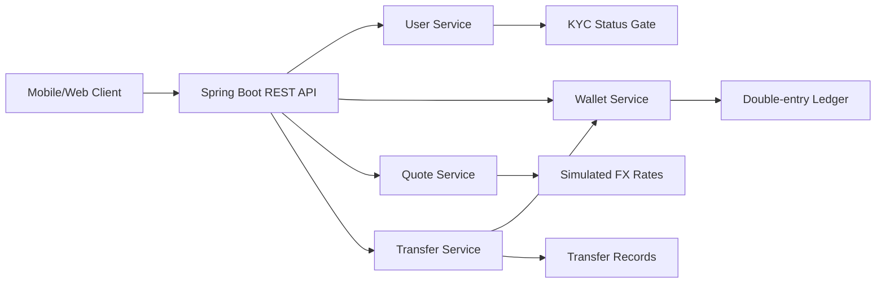
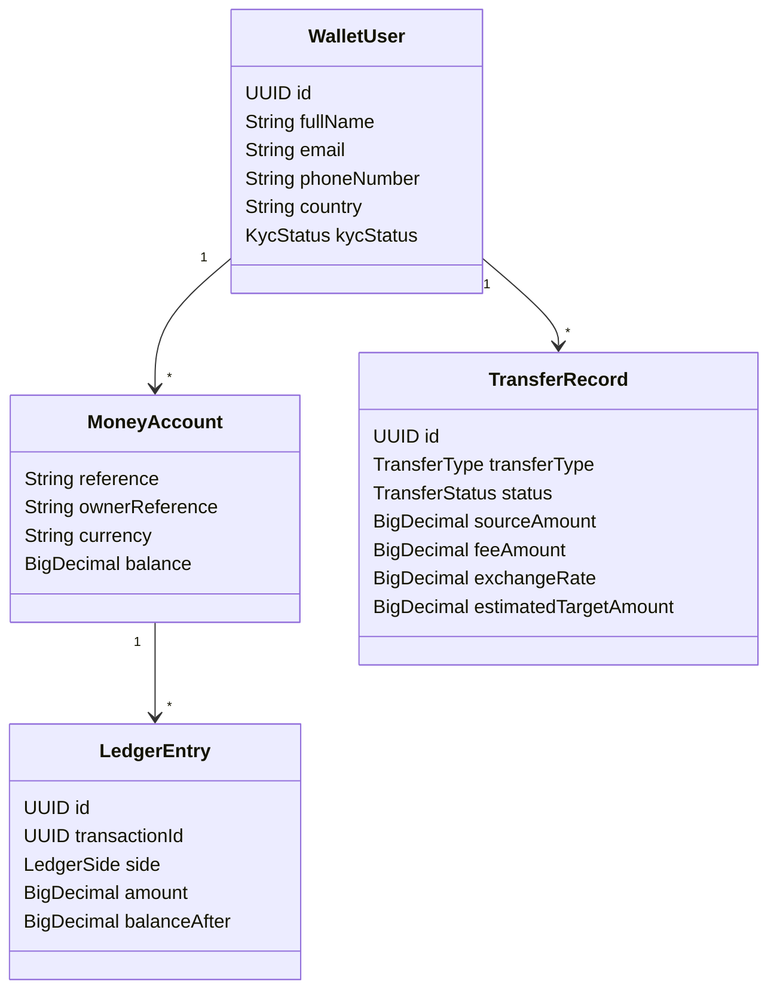
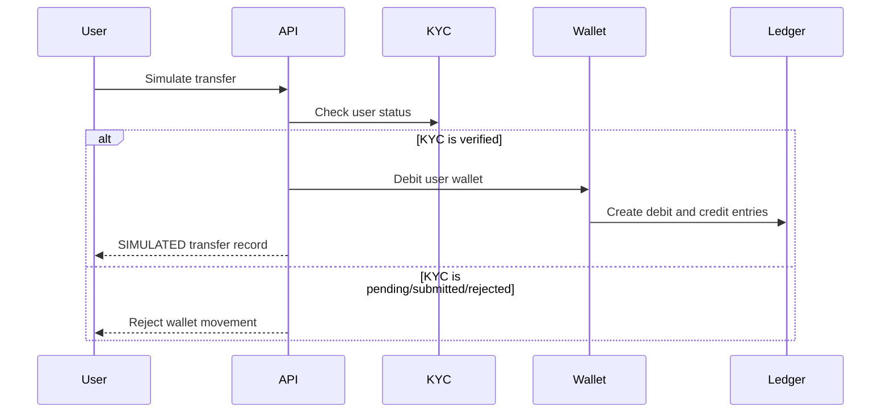

# Dior Wallet Design

This project is a Java/Spring Boot backend MVP for a Nigeria-first wallet, remittance, and exchange-wallet product.

It is intentionally built as a compliance-safe prototype: it does not move real money, hold customer funds, connect to banks, connect to crypto exchanges, or broadcast blockchain transactions.

## Product Scope

### MVP user flow

1. User creates an account.
2. User submits KYC details.
3. Admin/demo endpoint approves KYC.
4. User receives simulated wallet funding.
5. User requests a transfer quote.
6. User simulates a bank or Dior Wallet UID transfer.
7. User previews NGN to USDT or USDT to NGN swaps.
8. User edits profile details and profile picture.
9. User enables authenticator app, fingerprint unlock, PIN lock, and immediate lock.
10. System records wallet balance changes and ledger entries.

### Not included yet

- Real CBN-licensed payment rail integration
- Real IMTO/remittance integration
- Real SEC/VASP exchange integration
- Exchange-wallet transfer execution
- Customer fund custody
- Real BVN/NIN verification
- Production authentication
- Persistent database storage

## Backend Architecture



## Domain Model



## Compliance Gates

The current code blocks wallet movement until the user is KYC verified.



## First App Screen Design

These are the first mobile screens to build after the backend stabilizes.

### Home

```text
+----------------------------------+
| Balance                          |
| NGN 100,000.00                   |
|                                  |
| [Send] [Swap NGN/USDT] [Ledger]  |
|                                  |
| Recent Activity                  |
| - Simulated transfer to US       |
| - Demo wallet funding            |
+----------------------------------+
```

### KYC

```text
+----------------------------------+
| Verify Your Identity             |
| Full name                        |
| BVN                              |
| NIN                              |
| Residential address              |
|                                  |
| [Submit KYC]                     |
+----------------------------------+
```

### Transfer

```text
+----------------------------------+
| Send Money                       |
| Bank | Exchange soon | Dior         |
| From: NGN                        |
| To: USD                          |
| Amount: 25,000                   |
| Destination: Nigeria             |
| Bank account / wallet / UID      |
|                                  |
| Fee: NGN 500                     |
| Estimated receive: USD 14.70     |
|                                  |
| [Simulate Transfer]              |
+----------------------------------+
```

Nigeria is the default bank destination in the UI prototype, with Nigerian banks listed first. Exchange-wallet destinations are displayed as a coming-soon rail and support common exchange choices in the UI prototype: Bybit, Binance, Bitget, OKX, KuCoin, Gate.io, MEXC, HTX, Coinbase, Kraken, and Other exchange.

### Swap

```text
+----------------------------------+
| Swap NGN and USDT                |
| You pay: NGN 25,000              |
| You receive: USDT 14.94          |
| Rate: 0.00060                    |
| Fee: NGN 100                     |
|                                  |
| [Simulate Swap]                  |
+----------------------------------+
```

### Profile

```text
+----------------------------------+
| Edit Profile                     |
| Full name                        |
| Username                         |
| Email                            |
| Phone number                     |
| Country                          |
| Residential address              |
| Profile picture                  |
|                                  |
| [Save Profile]                   |
+----------------------------------+
```

### Security

```text
+----------------------------------+
| Security Settings                |
| Authenticator app: Enabled       |
| Fingerprint unlock: Enabled      |
| PIN lock: Enabled                |
| Immediate lock: Enabled          |
|                                  |
| [Lock Now]                       |
+----------------------------------+
```

The prototype lock screen blocks the app until the user enters the configured PIN or uses the simulated fingerprint button. Production biometric support should use the mobile platform secure APIs and should never store fingerprint data on the backend.

## API Summary

| Action | Method | Endpoint |
| --- | --- | --- |
| Create user | `POST` | `/api/users` |
| List users | `GET` | `/api/users` |
| Update profile | `PUT` | `/api/users/{userId}/profile` |
| Update profile picture | `PUT` | `/api/users/{userId}/profile-picture` |
| Update security settings | `PUT` | `/api/users/{userId}/security` |
| Submit KYC | `POST` | `/api/users/{userId}/kyc` |
| Approve KYC demo | `POST` | `/api/users/{userId}/kyc/approve` |
| Fund wallet demo | `POST` | `/api/wallets/{userId}/fund` |
| Get balances | `GET` | `/api/wallets/{userId}` |
| Get ledger | `GET` | `/api/wallets/{userId}/ledger` |
| Get transfer quote | `POST` | `/api/transfers/quote` |
| Simulate transfer | `POST` | `/api/transfers/simulate` |

## Next Engineering Milestones

1. Add PostgreSQL and Flyway migrations.
2. Add authentication and role-based admin endpoints.
3. Replace demo KYC approval with provider interfaces.
4. Add transaction limits and risk scoring.
5. Add partner adapter interfaces for payment, IMTO, and exchange/VASP rails.
6. Add reconciliation reports and exportable audit logs.
